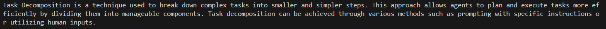
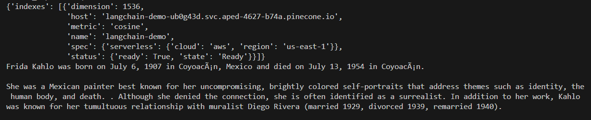

# TALLER 9: Large Language Model

Este taller se enfocó en crear un sistema de búsqueda eficiente para un grupo de documentos. Para lograrlo, se emplearon la biblioteca LangChain y el servicio de almacenamiento de vectores de Pinecone.

---
### Prerequisitos

* [Python 3.12.3](https://www.python.org/)
* [Pip 24.0](https://pypi.org/project/pip/)
* [Entorno virtual de Phyton](https://www.python.org/)
* [OpenAI API Key](https://openai.com/)
* [Pinecone API Key](https://www.pinecone.io/)

---

### Instalación y Ejecución

Para la instalación y ejecución de este proyecto los comandos  se deben ejecutar en una terminal **command prompt**.

1.Clonamos el repositorio

```
https://github.com/AREP2024-1/AREP_Taller09.git
```

2.Ingresamos a la carpeta del repositorio que clonamos anteriormente

```
cd AREP_Taller09
```

3.Creamos el entorno virtual de Python:

```
python -m venv venv
```

4.Activamos el entorno virtual de Python:

```
venv\Scripts\activate
```

5.Instalamos las dependencias del proyecto:

```
pip install -r requirements.txt

```

6.Debemos configurar las variables de entorno **OPENAI_API_KEY** y **PINECONE_API_KEY** en cada uno de los scripts, teniendo en cuenta lo siguiente:

***A.Configuración de OPENAI_API_KEY***

```
["OPENAI_API_KEY"] = "Openai-API-Key"
```

**Importante:** El valor de la variable **OPENAI_API_KEY** debe ser reemplazado por un llave, la cual se puede obtener en el siguiente enlace https://openai.com/.


***B.Configuración de PINECONE_API_KEY***

```
["PINECONE_API_KEY"] = "Pinecone-API-Key"
```

**Nota:** El valor de la variable **PINECONE_API_KEY** debe ser reemplazado por un llave, la cual se puede obtener en el siguiente enlace https://www.pinecone.io/.


En este taller realizamos tres ejercicios los cuales se presentan a continuación: 

---
### Ejercicio No.01:
Es un programa que nos permite enviar mensajes a Chatgpt y recuperar las respuestas.

1.Ejecute este ejercicio con el siguiente comando:

```
py main.py
```

2.Una vez ejecutado el programa, obtuvimos la respuesta a la pregunta **What is at the core of Popper's theory of science?** como se puede observar en la siguiente imagen:


---

### Ejercicio No.02:
Se escribio un RAG simple utilizando una base de datos vectorial en memoria.

1.Ejecute este ejercicio con el siguiente comando:

```
py llmmemorydb.py
```

2.Una vez ejecutado el programa, obtuvimos la respuesta a la pregunta **What is Task Decomposition?** como se puede observar en la siguiente imagen:



---
### Ejercicio No.03:
Se escribió un RAG usando Pinecone.

1.Ejecute este ejercicio con el siguiente comando:

```
py pineconeexample.py
```

**Nota:** Para este ejercicio creamos un índex en Pinecone con el nombre **langchain-demo** y una dimensión de 1536 como se puede observar en la siguiente imagen: 


2.Una vez ejecutado el programa, obtuvimos la respuesta a la pregunta **Who was Frida Kahlo?** como se puede observar en la siguiente imagen:



## Construido con

* [Python](https://www.python.org/): Es un lenguaje de programación de alto nivel, interpretado y multiparadigma utilizado para una amplia variedad de aplicaciones, desde desarrollo web hasta análisis de datos, inteligencia artificial, aprendizaje automático, automatización, scripting, desarrollo de juegos y mucho más.
* [Pip](https://pypi.org/project/pip/): Es un sistema de gestión de paquetes utilizado en Python para instalar y administrar bibliotecas de terceros, también conocidas como "paquetes". El nombre "Pip" es un acrónimo recursivo que significa "Pip Installs Packages".
* [Entorno virtual de Phyton](https://www.python.org/): Un entorno virtual en Python es una herramienta que permite crear un entorno de desarrollo aislado, independiente del entorno global del sistema. Esto significa que puedes tener diferentes versiones de paquetes y dependencias para distintos proyectos, sin que interfieran entre sí.
* [OpenAI API Key](https://openai.com/): Es una clave de autenticación necesaria para acceder y utilizar la API de OpenAI. OpenAI ofrece servicios y herramientas de inteligencia artificial, incluyendo modelos de lenguaje como GPT (Generative Pre-trained Transformer), que permiten a los desarrolladores integrar capacidades avanzadas de procesamiento de lenguaje natural en sus aplicaciones y proyectos.
* [Pinecone API Key](https://www.pinecone.io/): Es una plataforma de servicios de búsqueda y recuperación de vectores (vector search), diseñada para facilitar la búsqueda y recuperación de datos basada en similitudes vectoriales. La Pinecone API Key es una clave de autenticación necesaria para acceder y utilizar la API de Pinecone.
* [Visual Studio Code](https://openwebinars.net/blog/que-es-visual-studio-code-y-que-ventajas-ofrece/): Es un editor de código fuente desarrollado por Microsoft. Es software libre y multiplataforma, está disponible para Windows, GNU/Linux y macOS.

## Autor

* **[Karol Daniela Ladino Ladino](https://www.linkedin.com/in/karol-daniela-ladino-ladino-55164b272/)** - [20042000](https://github.com/20042000)


## Licencia
**©** Karol Daniela Ladino Ladino. Estudiante de Ingeniería de Sistemas de la Escuela Colombiana de Ingeniería Julio Garavito